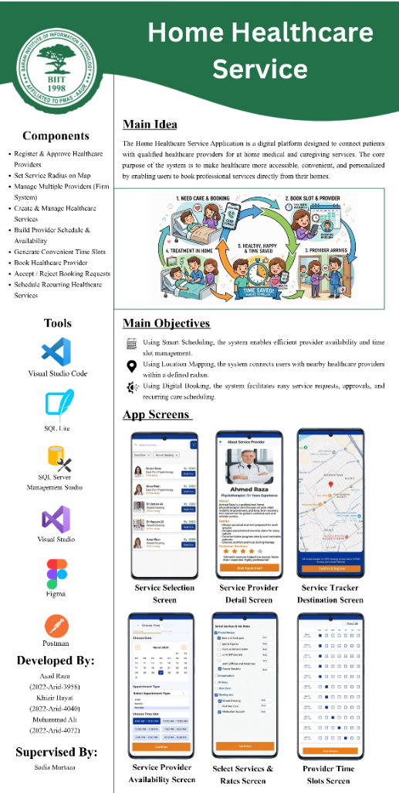

<div align="center">

# 🏥 Home Healthcare Service

### A Native Android Application for On-Demand Home Medical Care

[](https://kotlinlang.org/)
[](https://developer.android.com/)
[](https://www.sqlite.org/)
[](https://firebase.google.com/)
[](LICENSE)

*A production-quality Android platform that connects patients with qualified healthcare providers for at-home medical and caregiving services — making healthcare more accessible, convenient, and personalized.*

</div>

---

## 📋 Project Poster

<div align="center">
  
</div>

---

## 💡 Main Idea

The **Home Healthcare Service Application** is a native Android platform designed to connect patients with qualified healthcare providers for at-home medical and caregiving services. The core purpose is to make healthcare more **accessible**, **convenient**, and **personalized** by enabling users to book professional services directly from their homes.

---

## 🎯 Main Objectives

| Objective | Description |
|---|---|
| 📅 **Smart Scheduling** | Enables efficient provider availability and time-slot management |
| 📍 **Location Mapping** | Connects users with nearby healthcare providers within a defined radius |
| 📲 **Digital Booking** | Facilitates easy service requests, approvals, and recurring care scheduling |

---

## ✨ Core Features

| Feature | Description |
|---|---|
| **Register & Approve Providers** | Healthcare providers register and are approved before going live |
| **Service Radius on Map** | Providers set a geographic radius; patients see only local providers |
| **Firm / Multi-Provider System** | Healthcare firms can manage multiple providers under one account |
| **Create & Manage Services** | Providers define services, durations, and pricing |
| **Schedule & Availability Builder** | Providers configure their weekly availability and time slots |
| **Convenient Time Slot Generation** | System auto-generates bookable slots from provider availability |
| **Book a Healthcare Provider** | Patients browse, select, and book a preferred provider |
| **Accept / Reject Booking Requests** | Providers review incoming booking requests in real time |
| **Recurring Care Scheduling** | Patients set up automated recurring appointments for ongoing care |

---

## 📱 App Screens

### Booking & Provider Discovery

<table>
  <tr>
    <td align="center" width="33%">
      
      <br/><sub><b>Service Selection Screen</b></sub>
    </td>
    <td align="center" width="33%">
      
      <br/><sub><b>Service Provider Detail Screen</b></sub>
    </td>
    <td align="center" width="33%">
      
      <br/><sub><b>Service Tracker & Destination</b></sub>
    </td>
  </tr>
</table>

### Scheduling & Management

<table>
  <tr>
    <td align="center" width="33%">
      
      <br/><sub><b>Provider Availability Screen</b></sub>
    </td>
    <td align="center" width="33%">
      
      <br/><sub><b>Select Services & Rates Screen</b></sub>
    </td>
    <td align="center" width="33%">
      
      <br/><sub><b>Provider Time Slots Screen</b></sub>
    </td>
  </tr>
</table>

> 📌 **Note:** Screenshots above are from the live Android prototype. See the project poster above for a full overview.

---

## 🛠️ Tech Stack

| Layer | Technology |
|---|---|
| **Language** | Kotlin 1.9 |
| **Platform** | Android (Min SDK 26 / Target SDK 33) |
| **UI Framework** | XML Layouts + Material Design 3 |
| **Architecture** | MVVM (Model-View-ViewModel) + Repository Pattern |
| **Local Database** | SQLite (via Room Persistence Library) |
| **Authentication** | Firebase Authentication (Email/Password + Google Sign-In) |
| **Push Notifications** | Firebase Cloud Messaging (FCM) |
| **Maps & Location** | Google Maps SDK + Geofencing API |
| **Networking** | Retrofit 2 + OkHttp + Gson |
| **Async / Concurrency** | Kotlin Coroutines + Flow |
| **Dependency Injection** | Hilt (Dagger) |
| **Image Loading** | Glide |
| **Build System** | Gradle (Kotlin DSL) |

---

## 🏗️ Project Structure

```
HomeHealthcareService/
├── app/
│   ├── src/main/
│   │   ├── java/com/homehealth/
│   │   │   ├── data/
│   │   │   │   ├── local/          # Room Database, DAOs, Entities
│   │   │   │   ├── remote/         # Retrofit API service, DTOs
│   │   │   │   └── repository/     # Repository implementations
│   │   │   ├── domain/
│   │   │   │   ├── model/          # Domain models
│   │   │   │   └── usecase/        # Business logic use cases
│   │   │   ├── ui/
│   │   │   │   ├── auth/           # Login, Register, Role selection
│   │   │   │   ├── patient/        # Patient dashboard, booking flow
│   │   │   │   ├── provider/       # Provider dashboard, availability
│   │   │   │   ├── admin/          # Admin approval & management
│   │   │   │   └── shared/         # Common components & adapters
│   │   │   ├── di/                 # Hilt DI modules
│   │   │   └── utils/              # Extensions, helpers, constants
│   │   ├── res/
│   │   │   ├── layout/             # XML layout files
│   │   │   ├── drawable/           # Vector assets & backgrounds
│   │   │   └── values/             # Strings, colors, themes
│   │   └── AndroidManifest.xml
│   └── build.gradle.kts
├── docs/
│   └── images/                     # Screenshots & poster
├── build.gradle.kts
└── settings.gradle.kts
```

---

## 🚀 Getting Started

### Prerequisites
- Android Studio Hedgehog (2023.1.1) or later
- Android SDK 33+
- Google Firebase project with Authentication & FCM enabled
- Google Maps API key

### Setup

1. **Clone the repository**
   ```bash
   git clone https://github.com/AsadRaza067/Home-Healthcare-Management-System.git
   cd Home-Healthcare-Management-System
   ```

2. **Open in Android Studio**
   - File → Open → select the project folder
   - Let Gradle sync complete

3. **Configure Firebase**
   - Download `google-services.json` from your Firebase Console
   - Place it in the `app/` directory

4. **Add API Keys**
   - In `local.properties`, add:
     ```properties
     MAPS_API_KEY=your_google_maps_api_key
     ```

5. **Build and Run**
   - Connect a device or start an emulator (API 26+)
   - Click **▶ Run** in Android Studio

---

## 🔐 User Roles

| Role | Capabilities |
|---|---|
| **Patient** | Browse providers, book services, track visits, schedule recurring care |
| **Healthcare Provider** | Manage availability, accept/reject bookings, view schedule |
| **Firm Admin** | Manage multiple providers, approve service listings |
| **System Admin** | Approve provider registrations, monitor platform activity |

---

## 👥 Team

| Name | Roll Number |
|---|---|
| **Asad Raza** | 2022-Arid-3958 |
| **Khizir Hayat** | 2022-Arid-4040 |
| **Muhammad Ali** | 2022-Arid-4072 |

**Supervised by:** Sadia Murtaza

**Institution:** BIIT (Affiliated to PRAS, Arid University)

---

## 📄 License

This project is developed for academic (Final Year Project) and research purposes.

---

<div align="center">

**Home Healthcare Service** · Android (Kotlin) · 2026
[github.com/AsadRaza067](https://github.com/AsadRaza067)

</div>
